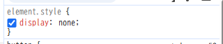

# 1. 15.4-10.1 および 15.4-10.2 の ToDo アプリに対してブラウザの開発者ツールから値の変更やプロパティの追加を試してみなさい

# 2. 開発者ツールで CSS に関して実行できる操作を検索エンジンで調べ、便利だと思ったものを 3 つ挙げなさい
* [CSS を変更する](https://developer.chrome.com/docs/devtools/css/reference?hl=ja#change)
* [CSS Flexbox レイアウトを検査してデバッグする](https://developer.chrome.com/docs/devtools/css/flexbox?hl=j)
* [疑似クラスを切り替える](https://developer.chrome.com/docs/devtools/css/reference?hl=ja#pseudo-class)

# 3. 15.4-10.2 のアプリの `body` 要素に対し、元々 HTML および JS 内で利用していなかった Tailwind CSS のクラス (`bg-rose-600` など何でも良い) を開発者ツールから追加すると変更が反映されないが、これは何故か調べなさい
Tailwind CSS がビルド時に未使用クラスを削除しているため、CSS に存在せず、開発者ツールで追加しても反映されない