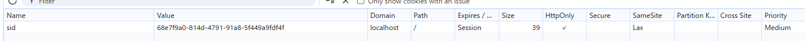
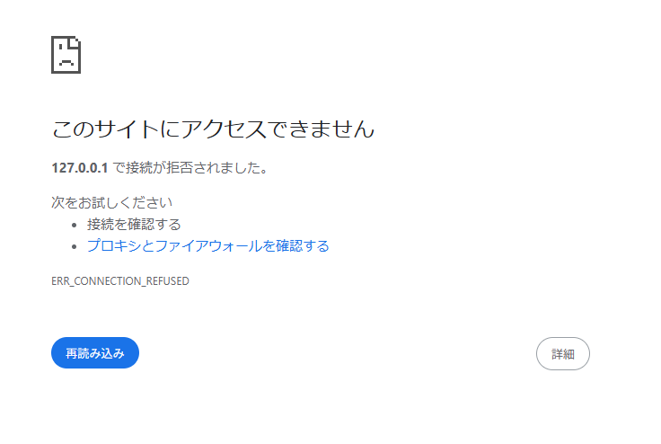

# index.js でdocument.cookie プロパティを console.logで表示する
何も表示されなかった
理由：`HttpOnly` であるため、JavaScript から読み取ることができなかった

# ブラウザの開発者コンソールで http://localhost:3000/ の Cookie を表示する
Cookie の値を見ることができた
理由：`HttpOnly` で制限されるものではないので、表示することができた

# ToDo アプリのタブをリロードする
sid の値に変化はなかった
理由：有効期限を定めていない、Session Cookie であるため

# 同一ブラウザの異なるタブやウィンドウで http://localhost:3000/ を開いて ToDo リストの状態を確認する
同じ sid であることが確認できた
理由：`Domain` や `Path` による制限がかかっていないため、Cookie の値を共有することができた

# シークレットウィンドウや異なるブラウザで http://localhost:3000/ を開いて ToDo リストの状態を確認する
異なる sid になった
理由：独立した別のブラウザ環境が一時的に作られるため、Cookie も別物になる。

# http://127.0.0.1:3000/ を開いて ToDo リストの状態を確認する
`localhost` というエイリアスでリクエストを受け付けるため、アクセスできなかった
